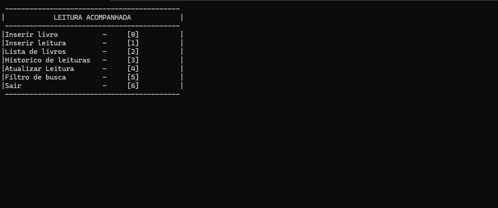

# Leitura acompanhada 

Leitura Acompanhada é um sistema em C# que simula o comportamento de uma biblioteca digital, utilizando persistência em JSON para armazenar dados de livros e leituras.

O sistema permite cadastrar livros e registrar leituras associadas a cada livro, garantindo que um livro só possa ter uma leitura ativa por vez. Cada livro e cada leitura possuem IDs únicos, garantindo separação e controle individual de cada registro.

Além disso, o usuário pode filtrar livros por título, autor ou gênero, acompanhar o histórico de leituras e atualizar o status de um livro para concluído assim que a leitura for finalizada, simulando a “devolução” do livro.

O projeto combina conceitos de Programação Orientada a Objetos e persistência em JSON para representar de forma simples e organizada a gestão de uma biblioteca.

  
  
  
  
  

## 🚀 Funcionalidades

**Inserir livros**
- Permite cadastrar novos livros informando título, autor e gênero.

  

**Inserir leitura**
- Adiciona uma leitura a um livro específico (via ID do livro).
- Cada leitura recebe um ID único.
- Registra a data de início da leitura.

  

**Lista de livros**
- Exibe todos os livros cadastrados com seus identificadores (IDs).

  

**Histórico de leitura**
- Mostra todas as leituras registradas de um determinado livro, com status e datas.

  

**Atualizar status da leitura**
- Permite atualizar o status de uma leitura para concluído.
- Define a data de término automaticamente quando a leitura é concluída.

  

**Filtro de busca**
- Permite buscar livros por título, autor ou gênero, retornando todos os livros que correspondem ao critério.

  

## 🔒 Validação
- O sistema realiza verificações para garantir a integridade dos dados inseridos, impedindo campos vazios, datas inválidas, status incorretos e salvamento de informações inconsistentes no JSON.